# KoDS Bot
A discord bot written in python and uses discord.py, API wrapper for discord's websocket api,
for management of guild Knights of the Dawned Sword. The bot feature multiple functions such as 
profile system, guild shop system, roles handling and much more.

# Setup
The functionalities of the bot is simple but some step need to be followed to get it working on 
for your server.

### Clone the Repository
1. Clone the repository `git clone https://github.com/nipunrautela/KoDS-Bot.git`
2. Or just download the zip and unpack.

### Setup a Venv and Libraries
1. Use venv or IDE based virtual environment setup.
2. Run `pip install -r requirements`

_Note: Using a virtual environment is not necessary, but it is recommended for ease of port._

### Add basic files and directories
1. Add `./cogs/assets/profile/image_cache/` if it doesn't exist. This directory temporarily store 
the profile images so that they can be easily sent to discord. _There is code to handle
automatic creation of the same_.
2. Add `./cogs/data/parties.json` with content as `{}`. Do not keep the file empty as the code expects
JSON content to be present in the file.
3. Create a file `./settings.py`.

### Setup on Discord Developer portal
1. Create an application on the 
[discord developer portal](https://discord.com/developers/docs/getting-started#step-1-creating-an-app).
2. Set up a bot for the application.
3. Turn on `Presence Intent`, `Server Members Intent`, and `Message Content Intent` under `Privileged
Gateway Intents`.
4. Generate the `OAuth2 URL` under the option with same name in developer portal. Use the link to
add the bot to the server.

### Setting up `settings.py`
1. Put the settings file in the root of the project
```python
BOT_NAME = 'KODS Bot'
TOKEN = ""
GUILD_ID = 0

RANK_REQUEST_CHANNEL = 0
RANK_REQUEST_REDIRECT = 0

DB_HOST = ""
DB_USER = ""
DB_PASS = ""
DB_PORT = 0
DB_NAME = ""

ORDER_CHANEL = 0

BOT_DIR = '.'

BLACKLIST_CHANNELS = [
    0,
]
```
2. `BOT_NAME` field can be changed if you want the bot to be called something different.
3. `TOKEN` needs to contain the bot token you receive from the discord developer portal.
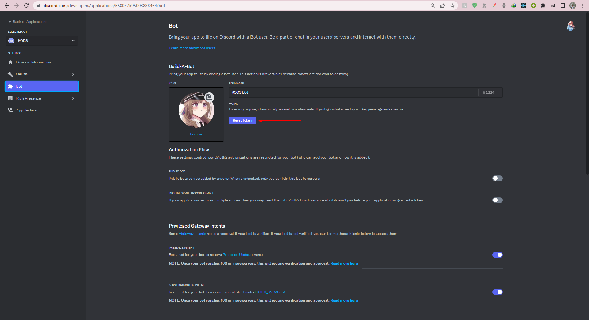
4. `GUILD_ID` should be set to the server ID of your guild server.
5. `RANK_REQUEST_CHANNEL` contains the channel ID where the rank promotion can be requested.
6. `RANK_REQUEST_REDIRECT` contains the channel ID where the above request will be sent for guild
leader to review.
7. `DB_HOST`, `DB_USER`, `DB_PASS`, `DB_PORT`, `DB_NAME` are the credentials and details for your
database setup. You can use environment variable or however you see fit.
8. `ORDER_CHANNEL` is the channel ID where the orders will be sent.
9. `BOT_DIR` can contain the full path of your Bot's directory. This can be useful when 
hosting you bot on a VPS.
10. `BLACKLIST_CHANNELS` is a list of channel IDs where the bots command can not be used.

# Samples

### List of Commands
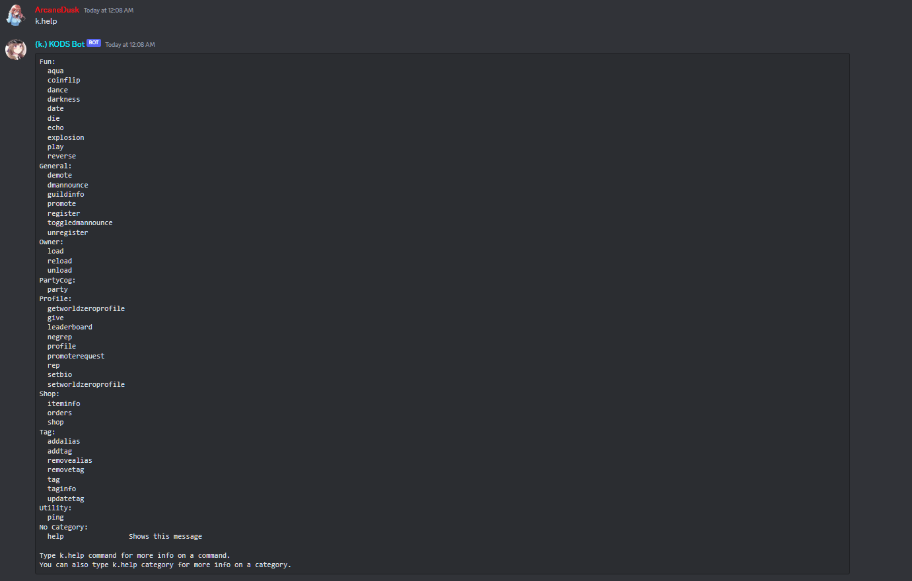

### Profile
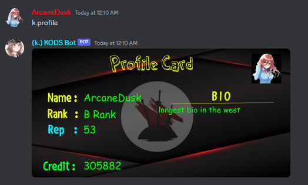

### Guild Info
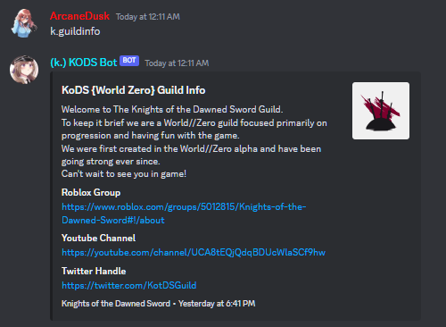

### Shop System
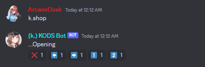
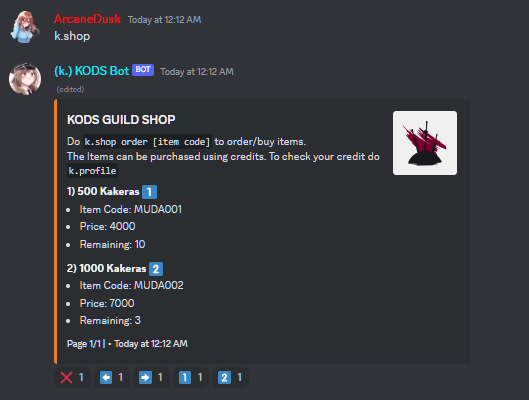
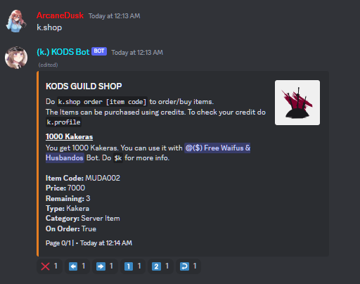

### Leaderboard
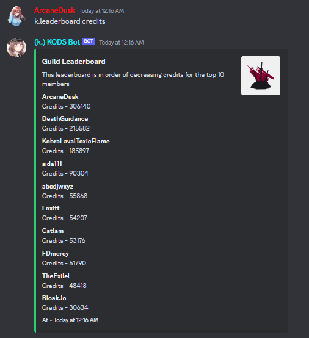
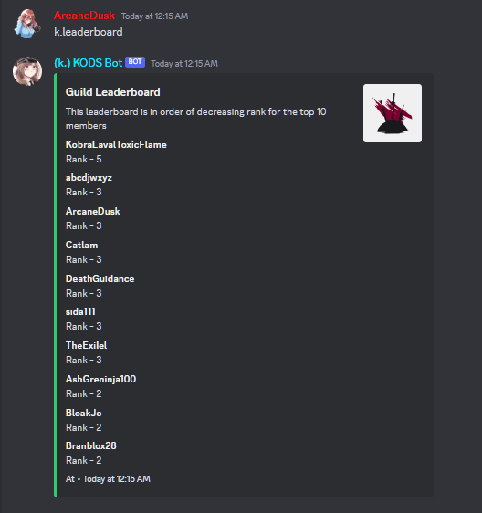

### Party System
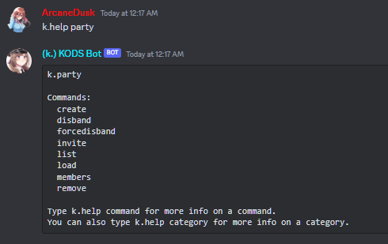
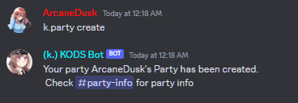
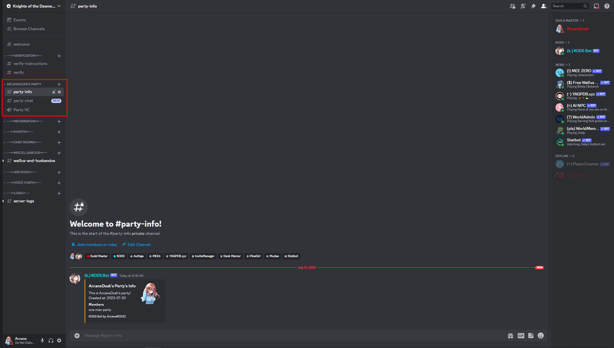

### Tag System
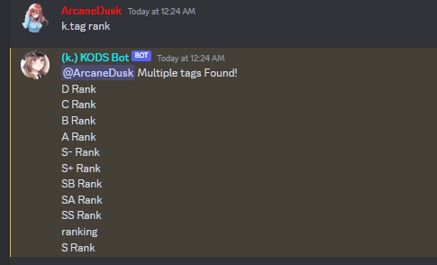
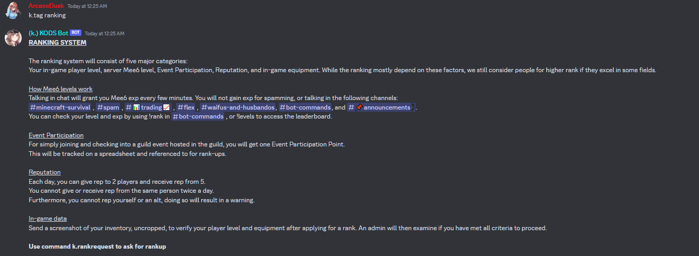
